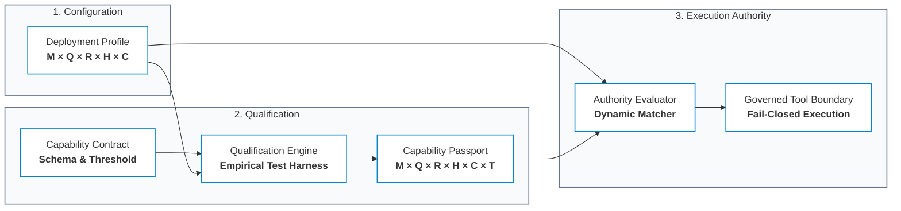
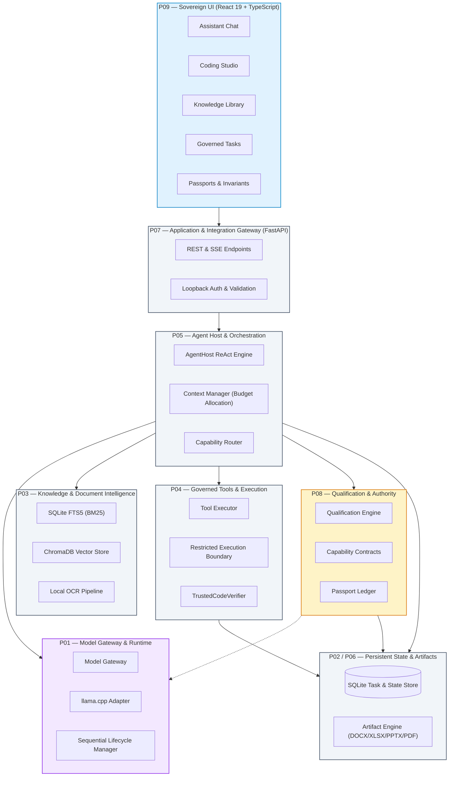
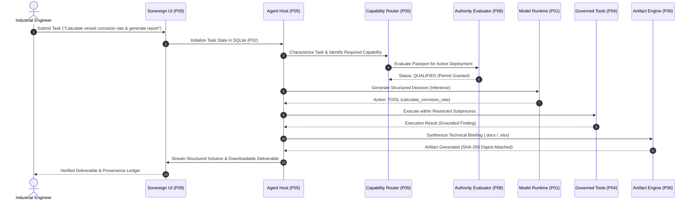
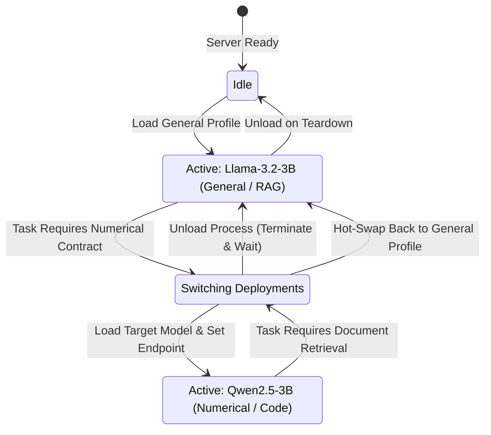
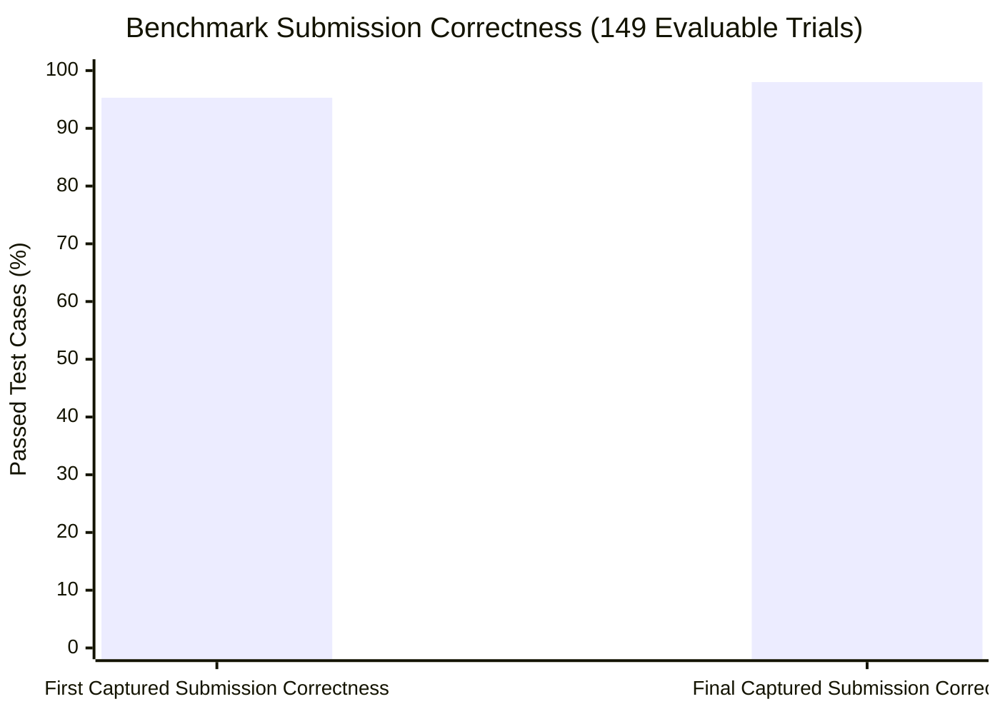
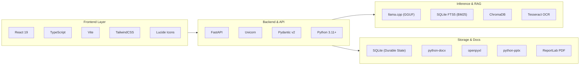

<div align="center">

# ??? Sovereign AI Workbench

### **Self-Hosted, On-Premise Agentic AI Workbench with Governed Execution & Capability Passports for Confidential Industrial Work**

*Smart India Hackathon (SIH) 2026 Prototype*

[](https://www.python.org/)
[](https://fastapi.tiangolo.com/)
[](https://react.dev/)
[](https://github.com/ggerganov/llama.cpp)
[](LICENSE)
[](#-quick-start)
[](#-empirical-benchmark-highlights)

[**Executive Overview**](#-executive-overview) •
[**Core Innovation**](#-core-technical-innovation) •
[**System Architecture**](#-system-architecture) •
[**Capabilities**](#-core-capabilities) •
[**Benchmarks**](#-empirical-benchmark-highlights) •
[**Quick Start**](#-quick-start) •
[**Documentation**](#-documentation-index)

</div>

---

## ?? Executive Overview

**Sovereign AI** is an on-premise, model-agnostic agentic AI workbench designed for confidential industrial sectors—including public sector undertakings (PSUs), defence manufacturing, refineries, thermal power stations, and critical national infrastructure.

In these mission-critical domains, proprietary intellectual property (piping and instrumentation diagrams, equipment ultrasonic inspection reports, process safety manuals, SCADA telemetry logs, and standard operating procedures) cannot leave the enterprise perimeter due to strict data residency laws and security mandates.

```
Traditional Cloud AI Workflows:
Sensitive Enterprise Data  --?  Public Cloud API  --?  Third-Party Infrastructure (High Data Exposure Risk)

Sovereign AI Architecture:
Sensitive Enterprise Data  --?  Local Host Execution  --?  Local Quantized Models (Zero Cloud Exfiltration)
```

Sovereign AI brings sovereign, governed AI execution directly to standard enterprise Windows workstations:
* ?? **Local Host Execution:** In-boundary execution over localhost loopback; observed socket audits confirm zero external WAN socket connections during runtime operations.
* ? **High-Performance Local Runtime:** Native `llama.cpp` inference powering quantized open-weight models (`Llama-3.2`, `Qwen2.5`, `DeepSeek-R1-Distill`) with GPU offloading and sequential model swapping.
* ?? **The Governance Triad:** Replaces uncalibrated model trust with empirical evaluation. Models are strictly gated by verified **Capability Passports** before being granted tool execution permits.
* ?? **Local Hybrid Knowledge Engine:** Ingests technical manuals and scanned inspection sheets using SQLite FTS5 BM25 lexical search, ChromaDB dense embeddings, and a local OCR pipeline.
* ??? **Governed In-Process Tool Execution:** Restricted subprocess boundary with execution timeouts, path containment, and sanitized environments.
* ?? **Verifiable Industrial Deliverables:** Automatically synthesizes multi-format reports (`.docx`, `.xlsx`, `.pptx`, `.pdf`, `.json`) accompanied by immutable SHA-256 byte manifests and exact source citations.

---

## ?? Core Technical Innovation

### The Governance Triad: $\text{Configuration} \neq \text{Qualification} \neq \text{Authority}$

Most agentic AI architectures conflate a model's availability with its permission to act. Sovereign AI formally separates these into three distinct lifecycle stages:



#### Mathematical Identities

1. **Deployment Profile Identity ($D_i$):**
   $$D_i = \text{SHA256}(\text{Model} \times \text{Quantization} \times \text{Runtime} \times \text{Hardware} \times \text{Context Budget})$$
   A deployment specifies *how* a model is physically hosted (e.g., `Llama-3.2-3B` $\times$ `Q4_K_M` $\times$ `llama_cpp` $\times$ `Vulkan1` $\times$ `8192`).

2. **Qualification Identity ($Q_i$):**
   $$Q_i = \text{SHA256}(D_i \times \text{Capability Contract} \times \text{Trial Thresholds})$$
   A model must execute a battery of empirical test trials against strict output schemas. A **Capability Passport** is minted only when the pass rate threshold is satisfied.

3. **Runtime Authority Check:**
   $$\text{Authorized} \iff \text{Passport}(Q_i).\text{Status} == \text{QUALIFIED} \land \text{Passport}(Q_i).D_i == D_{\text{active}}$$
   Passports are qualification evidence, not static authority tokens. If the underlying hardware, quantization, or runtime changes, authority is dynamically revoked fail-closed.

---

## ?? Core Capabilities

| Capability | Implementation Details | Operational Status |
| :--- | :--- | :--- |
| **Local Model Runtime** | Native `llama.cpp` integration with Vulkan/CUDA GPU offload and GGUF quantization. | **Implemented & Demonstrated** |
| **Capability Passports** | Cryptographically hashed deployment profiles evaluated against schema contracts. | **Implemented & Demonstrated** |
| **Multi-Model Routing** | Autonomous task characterization with automatic sequential model hot-swapping. | **Implemented & Demonstrated** |
| **Hybrid Knowledge Engine** | Dual-tier retrieval combining SQLite FTS5 BM25 lexical search and ChromaDB vectors. | **Implemented & Demonstrated** |
| **Scanned Document OCR** | Local image preprocessing and Tesseract OCR for technical inspection sheets and P&IDs. | **Implemented & Demonstrated** |
| **Governed Tool Boundary** | Subprocess execution with strict path confinement, timeouts, and sanitized environments. | **Implemented & Demonstrated** |
| **Persistent Task State** | ACID-compliant SQLite durable state ledger with automatic rollback and restart recovery. | **Implemented & Demonstrated** |
| **Verifiable Artifacts** | Programmatic generator for `.docx`, `.xlsx`, `.pptx`, and `.pdf` with SHA-256 byte proofs. | **Implemented & Demonstrated** |
| **Fail-Closed Governance** | Inconclusive verifications prevent task completion; unallowlisted tools rejected. | **Implemented & Evaluated** |
| **Observed Loopback Confinement** | Monitored process-level socket bindings confirm communication over localhost (`127.0.0.1`). | **Demonstrated & Audited** |

---

## ??? System Architecture

Sovereign AI follows a strict frozen package architecture (**P00–P09**) where every subsystem has explicit ownership boundaries:



---

## ?? End-to-End Governed Workflow

When a user submits an industrial task, Sovereign AI executes a deterministic 7-step pipeline:



---

## ?? Multi-Model Routing & Hot-Swapping

To support diverse industrial capabilities on constrained workstation hardware (e.g., 4 GB – 8 GB VRAM), Sovereign AI dynamically swaps specialized quantized models sequentially without overlapping memory:



---

## ?? Empirical Benchmark Highlights

Sovereign AI's local model capabilities were evaluated against a benchmark suite consisting of **50 diverse industrial and algorithmic tasks across 150 trials** using the locally hosted `Llama-3.2-3B-Instruct` deployment:

<div align="center">

| Evaluation Metric | Evaluated Result | Benchmark Scope |
| :--- | :---: | :--- |
| **Total Test Trials** | **150** | 50 Industrial Tasks $\times$ 3 Independent Trials |
| **Evaluable Submissions** | **149 / 150 (99.3%)** | Well-formed JSON & extractable Python scripts |
| **First Captured Submission Correctness** | **95.3%** | **142 / 149** evaluable submissions passed independent hidden assertions on Turn 1 |
| **Final Captured Submission Correctness** | **98.0%** | **146 / 149** evaluable submissions passed independent hidden assertions |
| **Hardware Footprint (VRAM)** | **2115 MiB** | Peak system-observed VRAM during active inference |

</div>



> **Evaluation Methodology Note:** These metrics measure the algorithmic correctness of captured Python code submissions evaluated independently against hidden test cases. They do not represent end-to-end agent workflow success or general model capabilities. For full trial-level breakdowns, terminal failure reasons, and complete methodology details, see the [Formal Evaluation Report](benchmarks/evaluations/llama_eval_20260919/evaluation_report.md) and [Benchmark Methodology Specification](docs/evaluation/BENCHMARK_METHODOLOGY.md).

---

## ??? Model Qualification Showcase

Under the Phase 3 empirical qualification protocol, the locally hosted `Llama-3.2-3B-Instruct` (Q4_K_M, 8192 context, Vulkan backend) was evaluated against specific schema-validation capability contracts:

<div align="center">

| Capability Contract | Version | Test Case | Target Evaluation Scope | Qualification Status |
| :--- | :---: | :---: | :--- | :---: |
| **`DocumentRetrieval_v1`** | `1.0` | `t_doc` | Structured retrieval JSON action formatting | **QUALIFIED** |
| **`AutomatedCoding_v1`** | `1.0` | `t_code` | Structured code execution JSON action formatting | **QUALIFIED** |
| **`AgentDecision_v1`** | `1.0` | `t_doc`\* | Multi-action JSON envelope formatting adherence | **QUALIFIED** |

</div>

*\* **Qualification Scope Note:** Passports are qualification evidence, not static authority tokens. In this pilot, `AgentDecision_v1` reproduced the original harness test case (`t_doc`) to verify JSON envelope formatting; it does not measure multi-step agentic planning.*

---

## ?? Verifiable Industrial Deliverables

Sovereign AI generates professional business deliverables directly on the local host. Every generated deliverable is accompanied by an immutable SHA-256 byte manifest, timestamp, and citation list:

```
evidence/artifacts/
+-- sample_deliverable_docx.docx   # Word Document (Executive summary, findings grid, tables)
+-- sample_deliverable_xlsx.xlsx   # Excel Workbook (Multi-sheet calculation tables)
+-- sample_deliverable_pptx.pptx   # PowerPoint Briefing (5-slide formal presentation)
+-- sample_deliverable_pdf.pdf     # Formatted PDF (Inspection sign-off sheet)
+-- sample_deliverable_markdown.md # Plaintext report with provenance tags
+-- sample_deliverable_json.json   # Machine-readable task manifest with typed findings
```

---

## ??? Technology Stack



---

## ?? Repository Structure

```
Sovereign-AI/
+-- src/sovereign/               # Core backend package (P00–P08)
¦   +-- core/                    # Domain models, agent host, router, qualification, authority
¦   ¦   +-- agent/               # ReAct host loop, parser, prompt builders
¦   ¦   +-- coding/              # Verifier logic & test harnesses
¦   ¦   +-- context/             # Context budget management & token allocation
¦   ¦   +-- qualification/       # Qualification engine, contracts, passport models
¦   ¦   +-- runtime/             # Model gateway, adapter interfaces, routing policies
¦   ¦   +-- state/               # Task lifecycle, findings, decisions, state models
¦   ¦   +-- tools/               # Tool registry, policy, and execution boundary
¦   +-- application/             # FastAPI REST / SSE routes & request schemas
¦   +-- infrastructure/          # llama.cpp adapter, SQLite repositories, document parsers, renderers
¦
+-- frontend/                    # React 19 + TypeScript single-page application (P09)
¦   +-- src/                     # Workspaces: Chat, Coding, Knowledge, Artifacts, Tasks, Passports
¦
+-- benchmarks/                  # Evaluation suites and empirical qualification data
¦   +-- evaluations/             # Final evaluation packages & metric analyses
¦   ¦   +-- llama_eval_20260919/ # Formal evaluation report, JSON metrics, CSV telemetry
¦   +-- qualification/           # Multi-model qualification scripts & pilot runners
¦   +-- results_full.jsonl       # Raw 150-trial coding benchmark records
¦   +-- tasks.json               # 50 industrial coding task specifications
¦
+-- docs/                        # Complete technical documentation index
¦   +-- architecture/            # Baseline specifications (P00–P09)
¦   +-- evaluation/              # Benchmark methodology & evaluation protocol
¦   +-- runbooks/                # Live demonstration runbooks & validation reports
¦   +-- presentations/           # SIH 2026 slide decks and visual previews
¦   +-- INDEX.md                 # Master documentation directory
¦
+-- evidence/                    # Empirical audit evidence & sample deliverables
¦   +-- artifacts/               # Sample validated deliverables (DOCX, XLSX, PPTX, PDF)
¦   +-- screenshots/             # 10 baseline UI workflow screenshots
¦   +-- logs/                    # Automated test logs and network socket audits
¦   +-- EVIDENCE_INDEX.md        # Master evidence index
¦
+-- archive/                     # Historical experiments and archived scratch scripts
¦   +-- patches/                 # Archived developer patch scripts
¦
+-- scripts/                     # Operational, diagnostic, and setup scripts
+-- tests/                       # Automated Pytest suite (Unit, integration, governance tests)
+-- run_server.py                # Backend application entrypoint
+-- requirements.txt             # Production dependencies
+-- .env.example                 # Environment configuration template
```

---

## ? Quick Start

### Prerequisites
* **Operating System:** Windows 10 / 11 (64-bit)
* **Python:** 3.11+
* **Node.js:** 18+ (for React frontend)
* **Local Inference Runtime:** `llama-server.exe` (from [llama.cpp releases](https://github.com/ggerganov/llama.cpp/releases))
* **Model Weights:** Quantized GGUF model (e.g., `Llama-3.2-3B-Instruct-Q4_K_M.gguf`)

### 1. Environment Setup

```powershell
# 1. Clone repository
git clone https://github.com/manas0615/Sovereign-AI.git
cd Sovereign-AI

# 2. Set up Python virtual environment
python -m venv .venv
.\.venv\Scripts\Activate.ps1
pip install -r requirements.txt -r requirements-dev.txt

# 3. Configure environment variables
Copy-Item .env.example .env
# Edit .env to set your llama_server_path and model_path
```

### 2. Launch Backend Application

```powershell
# Launch FastAPI application gateway on http://127.0.0.1:8000
python run_server.py
```

### 3. Launch Frontend Workspace

```powershell
# In a separate terminal
cd frontend
npm install
npm run dev
# Open browser at http://localhost:5173
```

### 4. Run Automated Test Suite

```powershell
# Execute targeted test suite (91 passing unit, governance, and routing tests)
pytest tests/test_agent_host.py tests/test_agent_parser.py tests/test_context_manager.py tests/test_p04_restricted_execution.py tests/test_p05_qualification_routing.py tests/test_p07_l2_api.py tests/test_p08_qualification.py tests/test_qualification_persistence.py tests/test_state.py tests/test_tools.py tests/test_trusted_coding_verification.py -v
```

---

## ?? Documentation Index

For in-depth architectural specifications, mathematical formulations, runbooks, and audit reports, refer to the authoritative documentation suite:

* ??? [**System Architecture Specification (P00–P09)**](docs/architecture/system-architecture.md)
* ?? [**Moonshot Innovation Audit: The Governance Triad**](docs/architecture/INNOVATION_MOON_AUDIT.md)
* ?? [**Empirical Benchmark & Evaluation Methodology**](docs/evaluation/BENCHMARK_METHODOLOGY.md)
* ?? [**Final Evaluation Report & Metrics Breakdown**](benchmarks/evaluations/llama_eval_20260919/evaluation_report.md)
* ?? [**SIH 2026 Live Demo Runbook**](docs/runbooks/SOVEREIGN_AI_SIH_DEMO_RUNBOOK.md)
* ?? [**Master Evidence Index & UI Screenshots**](evidence/EVIDENCE_INDEX.md)
* ?? [**Master Documentation Hub**](docs/INDEX.md)

---

<div align="center">

**Sovereign AI Workbench — Built for Confidential Industrial Intelligence**  
*Developed for Smart India Hackathon (SIH) 2026*

</div>
