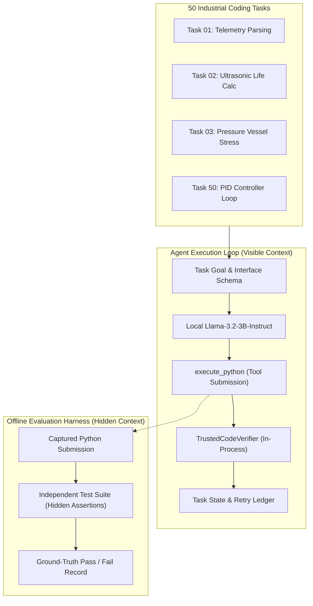
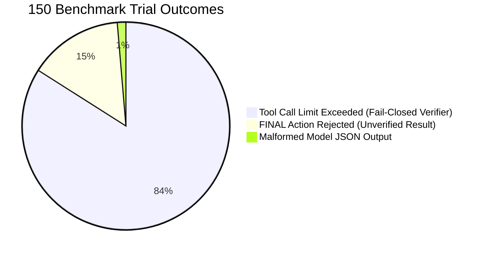
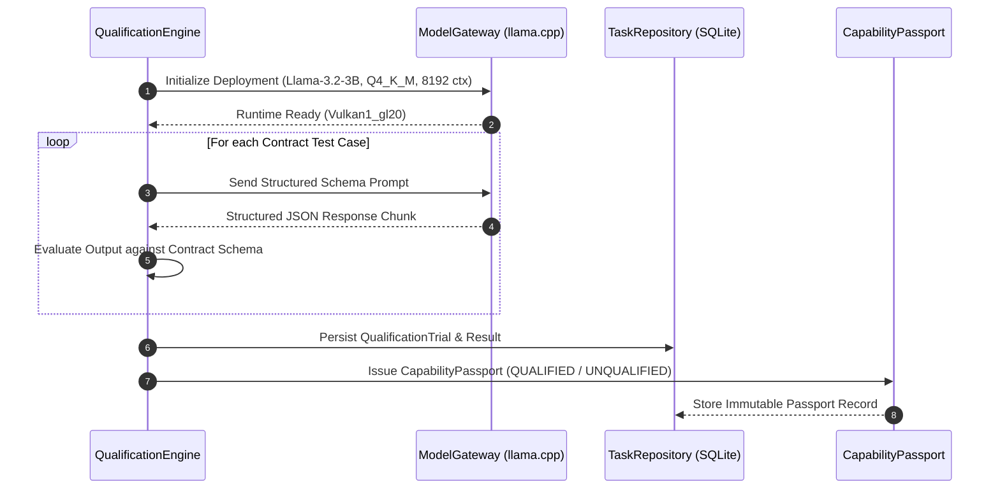

# Sovereign AI — Benchmark & Evaluation Methodology

This document defines the empirical evaluation protocol, task composition, test harness isolation, and scoring methodology used across the Sovereign AI Workbench.

---

## 1. Evaluation Philosophy

In confidential industrial AI systems, models cannot be blindly trusted on generic claims of parameter scale or cloud leaderboards. Empirical evaluation must test:

1. **Submission Correctness:** Does the model generate syntactically valid, algorithmically correct logic meeting explicit industrial acceptance criteria?
2. **Deterministic Isolation:** Are hidden evaluation test cases completely isolated from model-visible context, agent memory, and prompt histories?
3. **Execution Safety Boundaries:** Does the system fail closed when running under restricted host environments without sandboxing?
4. **Hardware-Bounded Stability:** Can the local model runtime operate reliably within strict physical memory constraints (e.g., 4 GB VRAM)?

---

## 2. 50-Task / 150-Trial Coding Benchmark

### 2.1 Benchmark Architecture

The automated coding benchmark evaluates local open-weight models against a diverse corpus of 50 industrial and algorithmic programming tasks across 3 independent trials each (150 total trials).

### 2.2 Metric Definitions

To ensure strict scientific integrity, metrics are categorized into distinct operational layers:

| Metric | Definition | Benchmark Result |
| :--- | :--- | :--- |
| **Total Trials** | Total test executions attempted across the 50 tasks (3 trials each). | **150** |
| **Evaluable Trials** | Trials that produced well-formed, parseable JSON and extractable Python submissions. | **149 / 150 (99.3%)** |
| **First Captured Submission Correctness** | Trials where the very first extracted code submission passed all independent hidden evaluation assertions. | **142 / 149 (95.3%)** |
| **Final Captured Submission Correctness** | Trials where the final extracted code submission passed all independent hidden evaluation assertions. | **146 / 149 (98.0%)** |
| **End-to-End Workflow Success** | Trials where the agent host marked the task complete under a verified pass from the execution boundary. | **0 / 150 (0.0%)\*** |

\* **Causality for 0% Workflow Success:** Under native Windows `DEGRADED` execution mode (lacking OS containerization), `TrustedCodeVerifier` intentionally fails closed with `Verification Inconclusive` rather than executing arbitrary untrusted code with simulated authority. The agent host enforces that no task may be finalized without a verified pass, correctly exhausting tool retries.

### 2.3 Terminal Reason Breakdown (150 Total Trials)

1. **126 Trials:** Reached tool call ceiling after repeated retry cycles due to `Verification Inconclusive`.
2. **22 Trials:** Forcibly terminated when the agent attempted `FINAL` without an authoritative verification pass.
3. **2 Trials:** Errored due to malformed JSON envelopes (1 of which had produced a correct submission on a prior turn; 1 non-evaluable).

---

## 3. Empirical Model Qualification Protocol (Phase 3 Pilot)

### 3.1 Model Passports & Governance Triad

Model qualification evaluates whether a specific deployment configuration qualifies for specific capability contracts before being granted runtime routing authority.

$$\text{Deployment Profile} = M \times Q \times R \times H \times C$$
$$\text{Qualification Identity} = \text{Deployment Profile} \times \text{Capability Contract}$$

### 3.2 Pilot Qualification Matrix

| Contract | Version | Test Case | Target Capability | Pilot Status |
| :--- | :--- | :--- | :--- | :--- |
| `DocumentRetrieval_v1` | `1.0` | `t_doc` | Structured retrieval tool call formatting | **QUALIFIED** |
| `AutomatedCoding_v1` | `1.0` | `t_code` | Structured coding tool call formatting | **QUALIFIED** |
| `AgentDecision_v1` | `1.0` | `t_doc`\* | Multi-action JSON envelope adherence | **QUALIFIED** |

\* *Methodological note: `AgentDecision_v1` in the pilot reproduces the original test harness using `t_doc` to evaluate JSON envelope compliance; it does not measure multi-step agentic planning.*

---

## 4. Hardware Telemetry & Resource Budgeting

During qualification runs, continuous 2-second background telemetry is recorded to ensure operations stay within the physical constraints of workstation GPUs (NVIDIA Quadro T1000, 4 GB VRAM):

* **Observed Peak VRAM:** 2115 MiB (~53.7% of physical budget)
* **Idle VRAM:** 0 MiB before initialization; returned to baseline after unload
* **Available System RAM:** Maintained 3.7 GB – 6.4 GB headroom throughout execution
* **Process Lifecycle:** Synchronous process termination with bounded fallback (`wait(5)` -> `kill()`) ensures zero memory leaks across model load/unload cycles.

---

## 5. Artifact & Evidence Catalog

All raw data, telemetry logs, and evaluation summaries are preserved in dedicated repositories:

* `benchmarks/results_full.jsonl`: Raw 150-trial benchmark records
* `benchmarks/tasks.json`: Complete 50-task specification definitions
* `benchmarks/evaluations/llama_eval_20260919/`: Final evaluation package
  * `evaluation_report.md`: Formal evaluation report
  * `benchmark_metrics.json`: Recalculated metrics and failure reasons
  * `pilot_results.json`: Serialized Capability Passports
  * `resource_metrics.csv`: 2-second timestamped telemetry
  * `limitations.md`: Complete scope and evidence constraints
